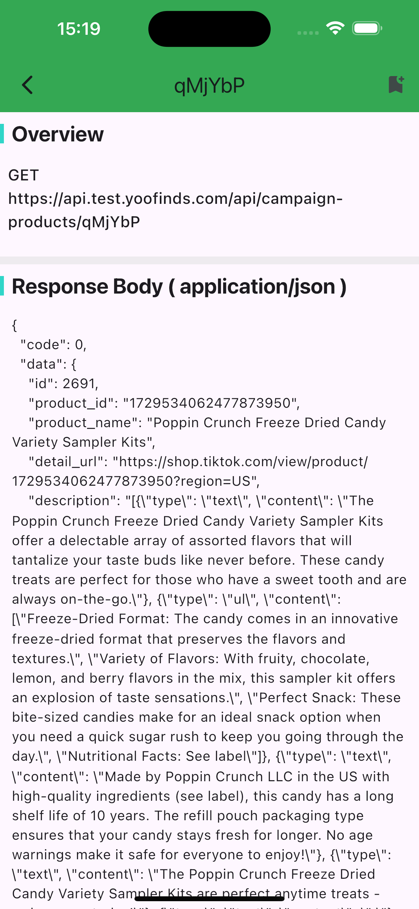

## Http Inspector

A lightweight in-app inspector for `Dio` that logs every request, response and error, and provides a UI to browse details, headers and bodies, as well as copy a ready-to-run cURL command.




---

### Features

- **Real-time logs**: Capture requests, responses, and errors with timestamps and durations
- **In-app viewer**:`HttpScopeView` to inspect logs in-app
- **cURL export**: One-click copy of the generated cURL for any request
- **Pretty JSON**: Formatted request/response bodies and headers
- **Search/filter UI**: Quickly locate requests with the built-in search components
- **Console coloring**: Configurable, developer-friendly colored logs
- **Opt-out in production**: Guard with `kDebugMode` to avoid exposing sensitive info

---

### Compatibility

- **Dart**: >= 2.17.6 < 4.0.0
- **Flutter**: >= 3.0.5
- **Dio**: ^5.x

---

## Installation

Add dependency to your `pubspec.yaml`:

```yaml
dependencies:
  http_inspector: ^1.0.2
```

Then run `flutter pub get`.

---

## Quick Start

1) Add `HttpInspectorInterceptor` to your `Dio` instance:

```dart
import 'package:dio/dio.dart';
import 'package:http_inspector/http_inspector.dart';

final dio = Dio();

dio.interceptors.add(
  HttpInspectorInterceptor(
    options: const FancyDioInspectorOptions(
      consoleOptions: FancyDioInspectorConsoleOptions(verbose: true),
    ),
  ),
);
```

2) Add the inspector UI to your app:

```dart
MaterialApp(
  home: Scaffold(
    endDrawer: kDebugMode ? const FancyDioInspectorView() : null,
    body: Center(
      child: ElevatedButton(
        onPressed: () {
          Navigator.of(context).push(
            MaterialPageRoute(
              builder: (_) => const HttpScopeView(), // or FancyDioInspectorView()
            ),
          );
        },
        child: const Text('Open Inspector'),
      ),
    ),
  ),
);
```

---

## Advanced Usage

### Options

```dart
HttpInspectorInterceptor(
  options: const FancyDioInspectorOptions(
    maxLogs: 200, // keep at most 200 entries in memory
    consoleOptions: FancyDioInspectorConsoleOptions(
      verbose: true,
      colorize: true,
      requestName: 'REQUEST',
      responseName: 'RESPONSE',
      errorName: 'ERROR',
    ),
  ),
  onRequestCreated: (requestOptions) {
    // custom hook when a request is recorded
  },
  onResponseCreated: (response) {
    // custom hook when a response is recorded
  },
  onErrorCreated: (dioError) {
    // custom hook when an error is recorded
  },
)
```

### cURL

Each `RequestOptions` has a computed `cURL` string. The UI exposes a copy action, and you can also access it programmatically via `requestOptions.cURL`.

---

## Example App

This repository includes a fully working example under `example/`.

```bash
cd example
flutter pub get
flutter run
```

---

## Notes on Privacy & Production

- **Do not log secrets**: Tokens, passwords or PII should not be printed or uploaded.
- **Guard with `kDebugMode`**: Only enable the inspector in debug/local builds.
- **Retention**: Entries are stored in-memory and capped by `maxLogs`.

---

## API Overview

- **Interceptor**: `HttpInspectorInterceptor`
- **Options**: `FancyDioInspectorOptions`, `FancyDioInspectorConsoleOptions`, `FancyDioInspectorTileOptions`, `FancyDioInspectorL10nOptions`
- **Views**: `FancyDioInspectorView`, `HttpScopeView`
- **Models**: `NetworkRequestModel`, `NetworkResponseModel`, `NetworkErrorModel`, `HttpRecord`

Refer to the source for full API details.

---

## Roadmap

- [x] Display Request Headers in **Key-Value** format  
- [x] Parse Query parameters into a **list view**  
- [x] Add **payload display** for POST requests  
- [x] Bold the URL display item  
- [x] Add **favorite interface** feature in the list  
- [x] Add a **clear button**  
- [x] Add **time grouping by minute**  
- [x] Add **filter support** for the displayed list  
- [x] Add **domain-based filter**  
- [x] Add the ability to **modify query parameters and send requests**  
  - Should be distinguished from normal network requests, can refer to Charles for interaction  
- [ ] Add **adaptive functionality** to integrate with other PC-based packet capture tools  

---

## Contributing

Contributions are welcome! Basic workflow:

1. Fork the repo and create a feature branch
2. Make changes following the existing code style
3. Run checks

```bash
flutter format .
flutter analyze
flutter test
```

4. Open a Pull Request with a clear description

---

## License

This project is licensed under the terms of the MIT License. See `LICENSE` for details.

---

## Changelog

See `CHANGELOG.md` for release notes.
