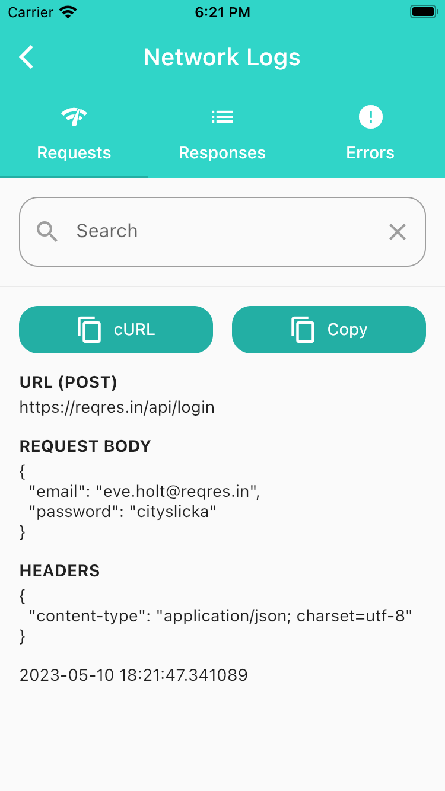
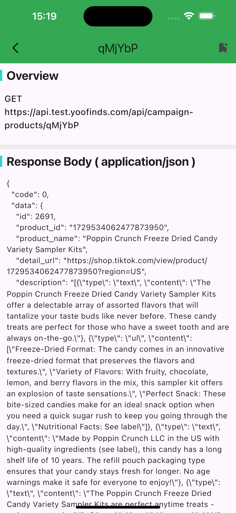

# Http Inspector

[](https://pub.dev/packages/http_inspector)
[](LICENSE)
[](https://flutter.dev)
[](https://pub.dev/packages/dio)

A lightweight in-app HTTP inspector for Flutter + Dio. Capture every request, response and error in real time — with a built-in UI, pretty JSON viewer, cURL export, and search/filter support.




---

## Features

- **Real-time logs** — Capture requests, responses, and errors with timestamps and durations
- **In-app viewer** — `HttpScopeView` to inspect logs without leaving the app
- **cURL export** — One-click copy of a ready-to-run cURL command for any request
- **Pretty JSON** — Formatted request/response bodies and headers
- **Search & filter** — Locate requests by URL, domain, or keyword
- **Console coloring** — Configurable colored logs for quick scanning
- **Production safe** — Guard with `kDebugMode` to avoid exposing sensitive data

---

## Installation

Add to your `pubspec.yaml`:

```yaml
dependencies:
  http_inspector: ^1.0.2
```

Then run:

```bash
flutter pub get
```

---

## Quick Start

**Step 1** — Add the interceptor to your `Dio` instance:

```dart
import 'package:dio/dio.dart';
import 'package:http_inspector/http_inspector.dart';

final dio = Dio();

dio.interceptors.add(
  HttpInspectorInterceptor(
    options: const FancyDioInspectorOptions(
      consoleOptions: FancyDioInspectorConsoleOptions(verbose: true),
    ),
  ),
);
```

**Step 2** — Add the inspector UI to your app:

```dart
import 'package:flutter/foundation.dart';

MaterialApp(
  home: Scaffold(
    // Option A: open via end drawer
    endDrawer: kDebugMode ? const FancyDioInspectorView() : null,

    // Option B: open via navigation
    body: ElevatedButton(
      onPressed: () => Navigator.of(context).push(
        MaterialPageRoute(builder: (_) => const HttpScopeView()),
      ),
      child: const Text('Open Inspector'),
    ),
  ),
);
```

---

## Advanced Usage

### Interceptor Options

```dart
HttpInspectorInterceptor(
  options: const FancyDioInspectorOptions(
    maxLogs: 200,
    consoleOptions: FancyDioInspectorConsoleOptions(
      verbose: true,
      colorize: true,
    ),
  ),
  onRequestCreated: (requestOptions) { /* custom hook */ },
  onResponseCreated: (response) { /* custom hook */ },
  onErrorCreated: (dioError) { /* custom hook */ },
)
```

### Access cURL Programmatically

```dart
// Each request has a computed cURL string
final curl = requestOptions.cURL;
```

---

## Example App

```bash
cd example
flutter pub get
flutter run
```

---

## API Reference

| Symbol | Type | Description |
|--------|------|-------------|
| `HttpInspectorInterceptor` | Interceptor | Attaches to Dio to capture traffic |
| `FancyDioInspectorOptions` | Options | Configure max logs, console output |
| `FancyDioInspectorView` | Widget | Full-screen inspector UI |
| `HttpScopeView` | Widget | Lightweight inspector view |
| `NetworkRequestModel` | Model | Captured request data |
| `NetworkResponseModel` | Model | Captured response data |
| `NetworkErrorModel` | Model | Captured error data |

---

## Privacy & Production

- Only enable the inspector in debug builds — guard with `kDebugMode`
- Do not log tokens, passwords, or PII
- Logs are stored in-memory and capped by `maxLogs`

---

## Compatibility

| Dependency | Version |
|------------|---------|
| Dart | >= 2.17.6 < 4.0.0 |
| Flutter | >= 3.0.5 |
| Dio | ^5.x |

---

## Contributing

1. Fork the repo and create a feature branch
2. Make changes following the existing code style
3. Run checks:

```bash
flutter format .
flutter analyze
flutter test
```

4. Open a Pull Request with a clear description

---

## License

MIT — see [LICENSE](LICENSE) for details.

## Changelog

See [CHANGELOG.md](CHANGELOG.md) for release notes.
