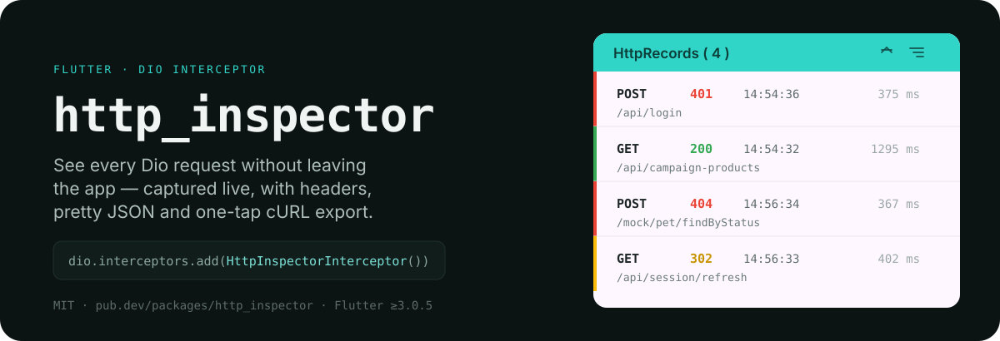
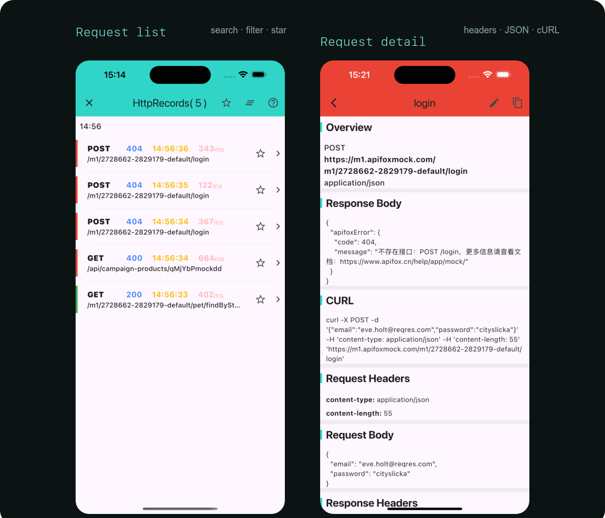

<p align="center">
  
</p>

<p align="center">
  <b>English</b> · <a href="README_zh.md">简体中文</a>
</p>

<p align="center">
  <a href="https://pub.dev/packages/http_inspector"></a>
  <a href="LICENSE"></a>
  <a href="https://flutter.dev"></a>
  <a href="https://pub.dev/packages/dio"></a>
</p>

Add one interceptor to your `Dio` instance and every request, response, and error is captured
as it happens. Open the built-in panel from inside your app to read the full exchange — status,
timing, headers, pretty-printed JSON — and copy any call as a runnable cURL command.

No proxy, no desktop tool, no leaving the app.



## Install

```yaml
dependencies:
  http_inspector: ^1.0.3
```

## Two steps to running

**1. Attach the interceptor** — this is what captures traffic:

```dart
import 'package:dio/dio.dart';
import 'package:http_inspector/http_inspector.dart';

final dio = Dio();

dio.interceptors.add(
  HttpInspectorInterceptor(
    options: const HttpInspectorOptions(
      maxLogs: 200,
      consoleOptions: HttpInspectorConsoleOptions(verbose: true),
    ),
  ),
);
```

**2. Open the panel** — push `HttpScopeView` from anywhere, guarded so it never ships to users:

```dart
import 'package:flutter/foundation.dart';

if (kDebugMode) {
  Navigator.of(context).push(
    MaterialPageRoute(builder: (_) => const HttpScopeView()),
  );
}
```

That's the whole integration. The list, search, detail view, and cURL copy are all built in.

## Tailoring the panel

`HttpScopeView` takes an `HttpScopeViewConfig` — this is where most real customization happens:

```dart
HttpScopeView(
  leading: CloseButton(onPressed: Navigator.of(context).pop),
  viewConfig: HttpScopeViewConfig(
    // Pin matching requests to the top; they survive "clear".
    alwaysStar: (record) => record.url.contains('/login'),

    // Show only what you care about.
    recordFilter: (record) => record.host == 'api.example.com',

    // Adds a share button on the detail page → send a record anywhere.
    onShareAction: (record) async {
      await myWebhook.post(record.toHttpRequestLog());
    },

    // Wire the help button to your own docs.
    manualUrl: 'https://example.com/debugging',
  ),
)
```

| Field | Type | What it does |
| --- | --- | --- |
| `recordFilter` | `bool Function(HttpRecord)` | Which records appear. Defaults to all. |
| `alwaysStar` | `bool Function(HttpRecord)` | Records that stay pinned and can't be cleared. |
| `itemBuilder` | `Widget Function(BuildContext, HttpRecord)` | Custom row widget for the list. |
| `customFilters` | `List<SingleFilter>` | Extra predicates layered on `recordFilter`. |
| `onShareAction` | `Future<void> Function(HttpRecord)?` | Shows a share button when set; hidden when `null`. |
| `manualUrl` | `String?` | URL behind the help button; hidden when `null`. |

### Interceptor hooks

`HttpInspectorInterceptor` also forwards each event, so you can log or forward traffic yourself:

```dart
HttpInspectorInterceptor(
  onRequestCreated: (requestOptions) { /* ... */ },
  onResponseCreated: (response)      { /* ... */ },
  onErrorCreated: (dioError)         { /* ... */ },
)
```

### Console output

`HttpInspectorConsoleOptions` controls the terminal logging that runs alongside the UI — toggle
it with `verbose`, and set `colorize` plus per-kind colors (`requestColor`, `responseColor`,
`errorColor`) for quick scanning.

## Public API

| Symbol | Kind | Purpose |
| --- | --- | --- |
| `HttpInspectorInterceptor` | Dio `Interceptor` | Attach to `Dio` to capture traffic |
| `HttpInspectorOptions` | Options | `maxLogs`, per-kind logging toggles, console options |
| `HttpInspectorConsoleOptions` | Options | Terminal logging: verbosity and colors |
| `HttpScopeView` | Widget | The inspector screen |
| `HttpScopeViewConfig` | Config | Filtering, starring, custom rows, share, help URL |
| `HttpRecord` | Model | One captured exchange — request, response/error, timing, `cURL` |

## Run the example

```bash
cd example
flutter pub get
flutter run
```

It sends a few real Dio calls (some deliberately failing) so you can watch them land in the list.

## Privacy & production

The panel exposes full request and response bodies, so keep it out of release builds:

- Guard every entry point with `kDebugMode`, as shown above.
- Don't rely on it to redact tokens or PII — it shows what Dio sends.
- Records live in memory only and are capped by `maxLogs` (default `50`).

## Compatibility

| Dependency | Version |
| --- | --- |
| Dart | `>=2.17.6 <4.0.0` |
| Flutter | `>=3.0.5` |
| Dio | `^5.x` |

## Contributing

```bash
dart format .
flutter analyze
flutter test
```

Then open a PR with a clear description. Issues and feature requests are welcome.

## License

MIT — see [LICENSE](LICENSE). Full release notes in [CHANGELOG.md](CHANGELOG.md).
