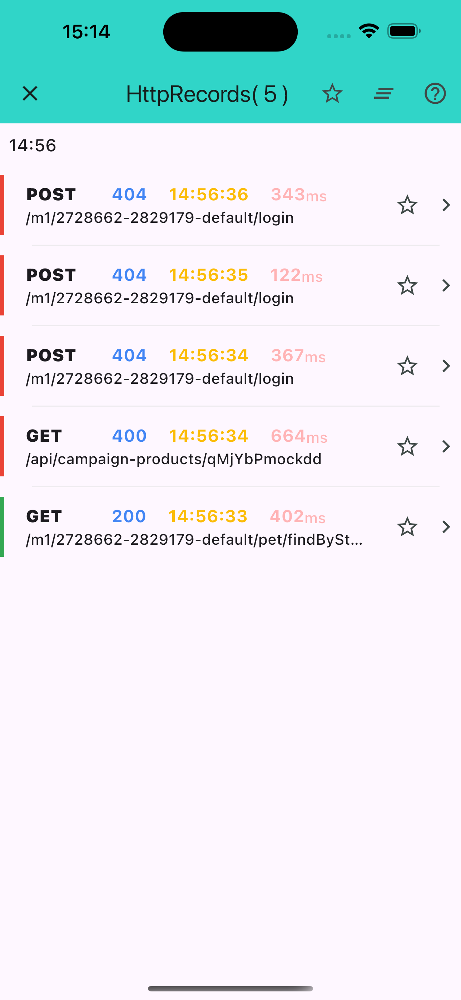
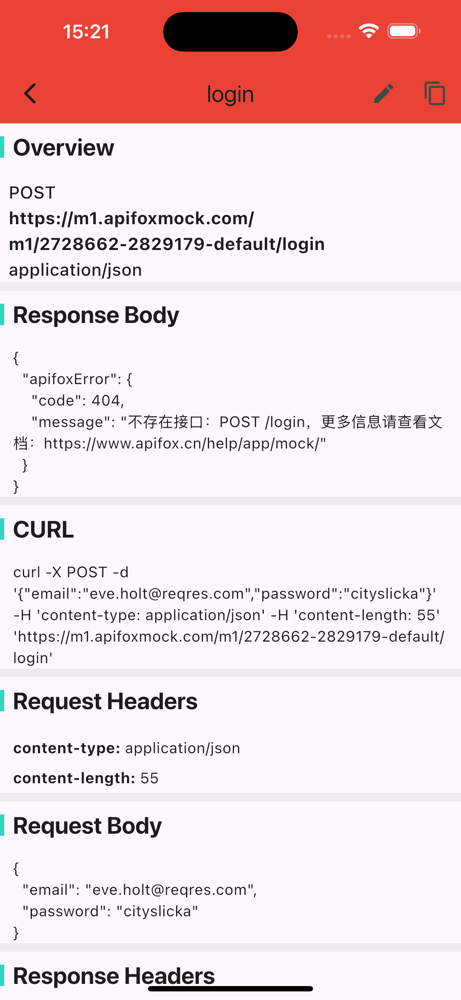

# Http Inspector — User Manual

This manual explains how to integrate and use `http_inspector` in a Flutter application to monitor, inspect, and debug Dio HTTP requests in real time.

## Core features

- **Real-time logs**: All HTTP(S) requests, responses, and errors are captured automatically, including timestamps and elapsed time.
- **One-tap cURL copy**: Copy a runnable cURL command for any request directly from the detail screen — useful for reproducing calls in a terminal or Postman.
- **Formatted JSON**: Request headers, request bodies, and response bodies are automatically pretty-printed.
- **Search & filter**: Use the built-in search bar to locate requests by URL, method, or any keyword. Domain-based filtering is also available.

## List screen

Displays a summary of all captured network requests.

Each row shows the HTTP method, URL, status code, and elapsed time. Starred requests are highlighted and remain visible even after clearing the log.

## Detail screen

Shows the full request and response for a single record.

Sections include:

- **URL** — full URI with method
- **Request headers** — displayed as key-value pairs
- **Request body** — formatted JSON (POST/PUT/PATCH)
- **Response headers**
- **Response body** — formatted JSON
- **cURL** — copy button for the generated curl command

## Privacy & security

- **Never use in production**: Always wrap the interceptor and view with `kDebugMode` to ensure all inspector functionality is disabled in release builds.
- **Protect sensitive data**: Avoid logging tokens, passwords, or personally identifiable information (PII). Apply redaction at the application layer before data reaches the interceptor if necessary.

---

## Hosting this manual with GitHub Pages

1. Push this file to the repository at `docs/manual.md`.
2. In the repository **Settings → Pages**, set:
   - **Source**: Deploy from a branch
   - **Branch**: `main`, folder `/docs`
3. After saving, GitHub will provide a public URL. Pass it to `HttpScopeViewConfig.manualUrl` to add a help link inside the inspector.
