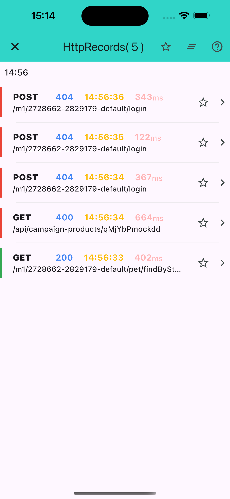
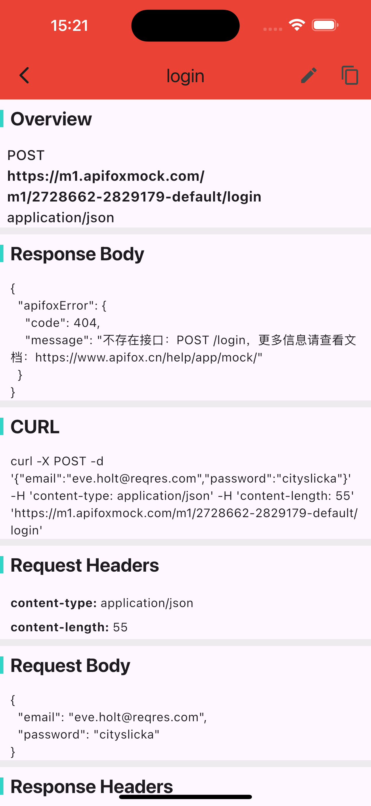

# manual
本手册旨在帮助开发者在 Flutter 应用中集成并高效使用 `http_inspector`，以实现对 `Dio` 网络请求的实时监控、审查和调试。

## 核心特性

- **实时日志**：自动捕获所有 HTTP(S) 请求、响应和异常，并记录时间戳与耗时。
- **一键复制 cURL**：在详情页轻松复制任何请求的 cURL 命令，便于在终端或 Postman 等工具中复现。
- **格式化 JSON**：自动美化并高亮显示 JSON 格式的请求头、请求体和响应体。
- **搜索与过滤**：内置搜索功能，可快速根据 URL、方法等关键词定位目标请求。同时支持通过代码进行编程化过滤。

## 列表页
所有已捕获的网络请求摘要

## 详情页
某一个请求和响应的完整信息

## 隐私与安全

- **切勿在生产环境中使用**：务必使用 `kDebugMode` 变量来确保 `http_inspector` 的所有功能仅在调试时启用。
- **保护敏感数据**：避免在日志中记录如 Token、密码或个人身份信息（PII）。如有必要，请在应用层进行脱敏处理。

## 附：使用 GitHub Pages 部署在线手册

1. 推送本文件至仓库（建议路径为 `docs/manual.md`）。
2. 在 GitHub 仓库的 `Settings` → `Pages` 中启用 GitHub Pages。
   - **Source**: 选择 "Deploy from a branch"。
   - **Branch**: 选择你的主分支（如 `main`），文件夹选择 `docs`。
3. 保存后，GitHub 会提供一个公共访问地址。将此地址配置到 `HttpScopeViewConfig.manualUrl` 即可。
